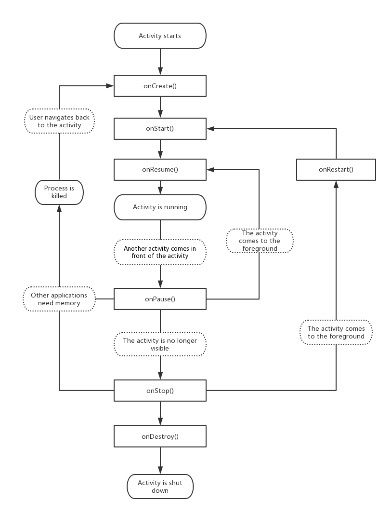

## Activity的生命周期
首先来看一张图

创建一个APP然后重写这些方法，并在其中加上打印语句，挨个测试各个流程:

Paused
另外一个Activity(BActivity)在前台显示并且获取了焦点，但是之前的Activity(AActivity)还是可见的
,BActivity在AActivity的上面并且BActivity是部分透明或者是不覆盖整个屏幕（只要AActivity没有被完全遮挡）
一个处于Paused的Activity是完全活着的（Activity对象保留在内存中，它保持着所有的状态和成员信息并且和
windows Manager保持着相连接）但可以在低内存时被系统杀死。

**Stopped**
一个Activity（AActivity）完全被另一个Activity（BActivity）挡住。处于Stopped状态的activity也是仍然活
着的（Activity对象保留在内存中，它保持所有的状态和成员信息，但是和Stopped不同的一点就是没有和
Windows Manager相连接）

onPause()
  系统即将恢复另一个Activity的时候，此方法用于提交一些未保存的持久性数据，停止动画和一些可能会消耗
  CPU的东西，应该尽可能快的完成，因为接下来的Acitivity在该方法完成之后才能开启，接下来要么运行
  onResume()方法要么运行onStop()方法。

**onStop()**
  activity 对用户不可见时调用此方法，这方法可能被调用，因为它即将被销毁，或者因为另外一个activity（
  已经存在的或者新的activity)已经被恢复然后覆盖了这个Activity。
  

**启动过程**
onCreate()-\>onStart()-\>onResume()

**AActivity 启动 BActivity**
A-\>onPause()
B-\>onCreate()
B-\>onStart()
B-\>on
