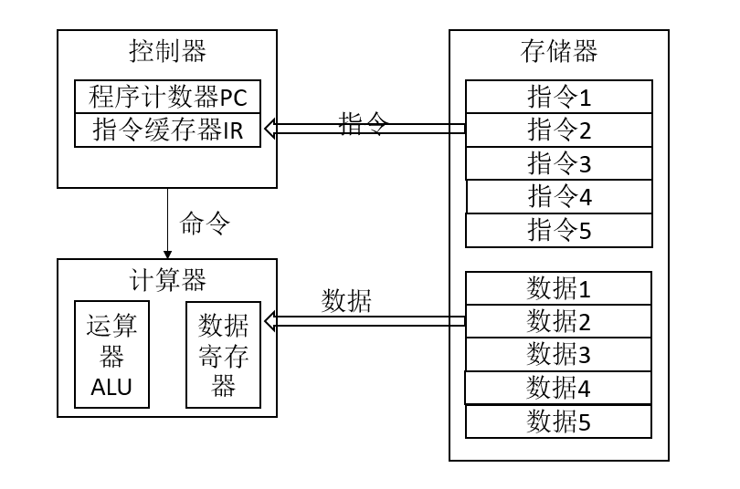
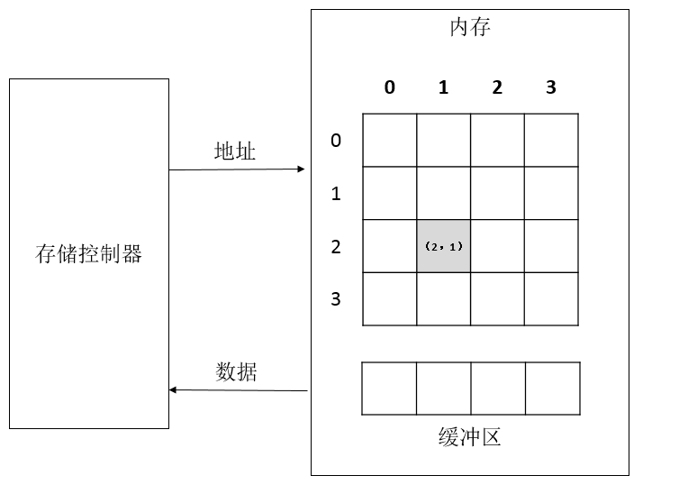
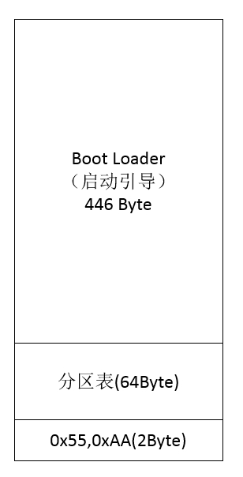

## 计算机的组成

#### 计算机的前世今生
1. 亚喀尔织布机  思想上的继承，基本思想读取存储介质的0和1来进行计算
  - 机械式
2. 巴比奇 差分机，利用齿轮+穿孔卡片
  - 机械式
3. 穿孔卡片 统计数据（IBM）
  - 机械式
4. 第一台电子计算机，求解线性方程组，电子式(真空管、电容、二进制、逻辑运算)
  - 电子式
  - 逻辑运算：and or notor
5. 第一台通用电子计算机(可编程),ENIAC
  - 电子式
  - 可编程
6. 冯诺依曼：EDVAC 
  - 五大组件(输入、输出、存储、控制和存储) 
7. 电子计算机
  - 个人电子计算机
  - 服务器
    - PC 服务器
    - 小型机
    - 大型机

#### **计算机的组成和工作原理**
1. 硬件设备,利用总线互联，存在总线占用的问题。
  - 声卡
  - 显卡
  - 网卡
  - 内存
  - ……  
2. 五大组件
  计算机一次处理的数据长度（即CPU一次性处理的数据长度）按字长来处理的，32位的系统字长为4字节，64位的
  操作系统字长为8字节。一个字节8Bit。
  输入、输出、存储器、控制器、计算器
   
  - 程序计数器：程序下一步运行的指令
  - 指令缓存器：程序正在运行的指令

3. 内存(RAM) 
  * 静态内存:触发器，L1、L2缓存
  * 动态内存:电容充放电，内存
  
  * 内存中的数据是以8位(即1个字节)为一组存取，存储控制器向内存发送取数据的指令，指令中包含着数据的地
  址，内存返回数据
4. 硬盘(外部存储)
  * 盘面
  * 磁道
  * 扇区
  * 数据读取时间 = 寻道时间 + 定位扇区时间 + 数据读取时间 + 传输时间
  读取玩一个扇区之后，再重新寻道读取下一个扇区。

5. 冯 诺依曼 计算机结构
  * 五大组件:输入、输出、存储、控制、计算
  * **数据和指令都是以二进制的形式存储在内存当中的,指令和数据编译时确定存储地址**
  * 计算器是不区分指令和数据的
  * 指令分为操作码和操作数
  * 指令的执行分为取值、译码、执行三个过程
  * 指令这个三个过程互不干扰，但又有一定的顺序，可组成流水线
#### 速度不匹配
   CPU的运行速度远远大于内存的存取速度,内存的存取速度又远远大于外村的存取速度,这就存在速度不匹配的情
   况
  1. 提升硬盘等存储设备的存取速度以与CPU匹配
  2. 承认局限，但充分压榨CPU的能力，让CPU忙死
    * 同步:例如IO时CPU一致在等待，
    * 异步:例如DMA，DMA负责硬盘数据的读取，数据读取完成后通知CPU
    * 顺序:程序挨个执行
    * 并发:时分复用，为多个程序分不同的时间段，每个程序执行小段时间，实现多个程序共同执行的现象
    * 并行:多个CPU或者一个CPU的多个核同时运行多个程序。
    * 增加中间层(缓存)
      上帝规则：局部性原理
      * 内部缓存，CPU缓存
      * WEB缓存，memcached、redis
      * 缓存的清除策略：FIFO(先进先出)、LRU(Least Recently Used)最近最久未使用、LFU(Least Frequently Used)最近最少使用
  3. 计算机的启动
    * CPU读取指令，然后读取BIOS,进入BIOS进行硬件自检等程序，检测完毕后根据CMOS的设定，读取MBR(存储设
        备中的一个扇区512Byte),检测第一个扇区的最后两个字节是否为0x55和0xAA,是的话就认为该存储设备存
    在操作系统
    

  

